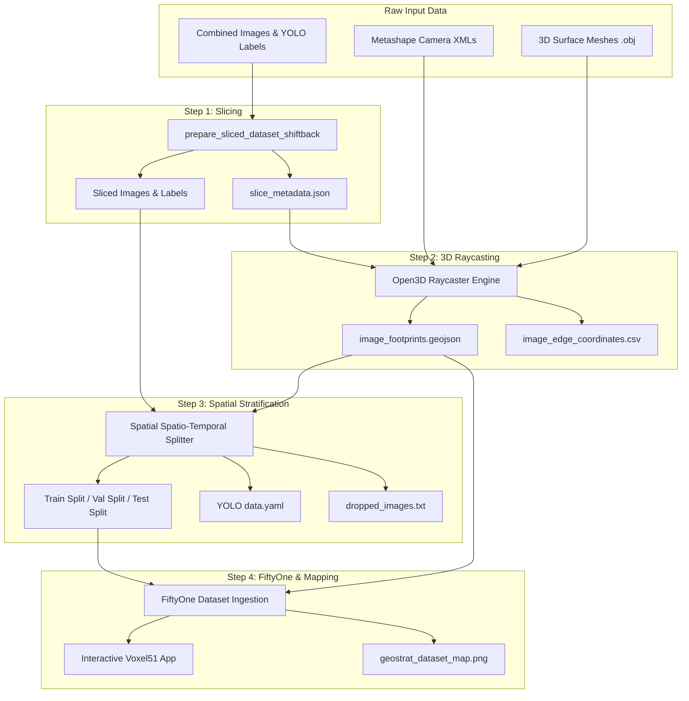

# Geospatial YOLO Pipeline (geospatial-yolo-pipeline)

[](https://pixi.sh)
[](https://www.python.org/)
[](http://www.open3d.org/)
[](https://voxel51.com/fiftyone/)

A robust, multi-campaign pipeline for **slicing, raycasting, stratifying, and mapping YOLO datasets** derived from high-resolution aerial imagery. 

The pipeline ensures high-quality dataset preparation for object detection models by:
1. **Slicing** large orthophoto sensors/tiles into model-ready patches while preserving local coordinate bounds.
2. **Raycasting** image slice corners onto 3D surface meshes (e.g., photogrammetry digital twin models) to compute accurate real-world geospatial footprints.
3. **Stratifying** datasets using spatial partitions (e.g., North-South separation) to prevent geographic data leakage during validation and testing.
4. **Ingesting** georeferenced slices into **Voxel51 FiftyOne** for interactive visualization and spatial queries, and generating cartographic split maps.

---

## 🗺️ Pipeline Architecture & Workflow



---

## 🛠️ Environment Setup & Dependencies

This project uses [Pixi](https://pixi.sh) for declarative dependency and task management. It integrates Conda packages for complex geospatial/3D graphics libraries with PyPI packages to prevent library collisions.

### Installation

To set up the environment, run:

```bash
# Install Pixi (if not already installed)
curl -fsSL https://pixi.sh/install.sh | bash

# Initialize and install all dependencies
pixi install
```

### Dependencies Overview
- **Core Environment**: Python `3.10.*`, NumPy `<2.0.0`, `tqdm`.
- **Geospatial & Cartography**: `geopandas`, `shapely`, `pyproj`, `contextily`, `matplotlib`, `matplotlib-scalebar`, `seaborn`.
- **3D Graphics & ML Visuals**:
  - `open3d` (PyPI) - Tensor-based raycasting and mesh interface.
  - `fiftyone` (PyPI) - Dataset exploration, metadata curation, and GIS mapping.
  - `opencv-python` (PyPI) - Fast image operations (slicing and cropping).

---

## 🚀 Execution Tasks
The project configuration defines four sequential CLI tasks inside [pixi.toml](file:///C:/Users/emilb/_trainer_dataset_prep/pixi.toml) which map directly to executable Python scripts:

```bash
# Step 1: Slice the orthophoto dataset into patches
pixi run slice          # Runs 1_slicer.py

# Step 2: Raycast local coordinates onto the 3D meshes to get GeoJSON footprints
pixi run raycast        # Runs 2_raycaster.py

# Step 3: Stratify the sliced images into geographically separated Train/Val/Test subsets
pixi run stratify       # Runs 3_stratification.py

# Step 4: Ingest the final dataset into FiftyOne and draw static cartographic maps
pixi run visualize      # Runs 4_fiftyone.py
```

---

## 📖 Pipeline Breakdown

The pipeline code is modularized into four standalone scripts:

### 1. Dataset Slicing (Metadata Export) - [1_slicer.py](file:///C:/Users/emilb/_trainer_dataset_prep/1_slicer.py)
* **Function**: `prepare_sliced_dataset_shiftback(...)`
* **Purpose**: Divides large, high-resolution source orthophotos and associated YOLO annotations into standard tile sizes (e.g., `1024x1024` pixels).
* **Key Innovation**: Tracks the exact pixel bounding box of every generated tile relative to the parent sensor and exports a `slice_metadata.json` mapping database. This preserves local spatial references so the raycaster knows exactly where each crop originated on the parent sensor.

### 2. 3D Raycasting (Georeferencing) - [2_raycaster.py](file:///C:/Users/emilb/_trainer_dataset_prep/2_raycaster.py)
* **Function**: `run_multi_campaign_pipeline(...)`
* **Purpose**: Projects the local 2D pixel coordinates of each image slice corner back through the camera sensor model into 3D UTM coordinate space.
* **Mechanism**:
  - Parses camera projection orientation from Metashape XML files (`cameras.xml` / `cameras_33n.xml`).
  - Sets up an Open3D tensor-based raycaster scene using highly detailed decimate 3D meshes (`.obj`).
  - Casts rays from the cameras' optical centers through the slice boundary corners to find the exact intersection with the digital twin mesh surface.
  - Uses `pyproj` to transform the coordinates to standard EPSG zones (e.g., `32633` WGS 84 / UTM zone 33N).
* **Outputs**:
  - `image_footprints.geojson`: Detailed spatial polygons for all georeferenced slices.
  - `image_edge_coordinates.csv`: Tabular coordinate limits.

### 3. Spatial Stratification - [3_stratification.py](file:///C:/Users/emilb/_trainer_dataset_prep/3_stratification.py)
* **Function**: `generate_spatial_splits(...)` and `build_dataset_structure(...)`
* **Purpose**: Implements a spatial train-test split that avoids spatial autocorrelation (data leakage). Simply splitting slices randomly causes neighboring (overlapping) slices to fall into both Train and Test, yielding overly optimistic evaluation metrics.
* **Geospatial Precision Update**: 
  Calculations for polygon areas and centroid checking are projected to **EPSG:32633 (UTM Zone 33N)** instead of Web Mercator (EPSG:3857) to ensure metric accuracy and prevent area scale distortion inflation.
* **Mechanism**:
  - Automatically cleans bowtie or invalid geometries in the raycasted GeoJSON footprints.
  - Drops oversized polygons (e.g., raycaster misses or boundary noise exceeding `600%` of the average area).
  - Segregates data geographically: allocating the southern region (South) to **TEST**, northern region (North) to **VAL**, and central regions to **TRAIN**.
  - Creates a boundary buffer: overlapping or boundary-crossing slices are dropped to guarantee independent validation.
* **Outputs**:
  - Sliced dataset organized into YOLO-compliant folder structures (`images/train`, `labels/train`, etc.).
  - `data.yaml`: YOLOv8-compatible dataset configuration.
  - `dropped_images.txt`: Diagnostics of slices discarded due to size or boundary-clash.

### 4. FiftyOne Ingestion & Visualization - [4_fiftyone.py](file:///C:/Users/emilb/_trainer_dataset_prep/4_fiftyone.py)
* **Function**: `load_and_visualize_dataset(...)`
* **Purpose**: Ingests dataset splits into FiftyOne for spatial visualization and renders publication-ready spatial cohort maps.
* **Dynamic Path Correction**:
  Resolves the hardcoded paths bug by dynamically finding the `source_images_dir` (`folder_path.parent / "sliced_dataset" / "images"`) to correctly include the campaign folders and enable "ghost" boundary buffer injection.
* **Key Features**:
  - Parses the `image_footprints.geojson` file to calculate the footprint centroids.
  - Ingests samples and attaches spatial GPS labels (`fo.GeoLocation`) to each dataset record.
  - Spawns the FiftyOne server and prints the connection URL prominently to standard output without launching the browser tab automatically (preventing popups).
  - Calls a cartographic engine (`contextily` + `matplotlib` + `matplotlib-scalebar`) to render an overview map (`geostrat_dataset_map.png`) showing spatial training groups, with the map legend positioned cleanly outside the plot boundaries to avoid overlap.


---

## 📈 Example Processing Outputs (Diagnostics)

```text
===Raycasting===
Processing Campaign 2023... cameras.xml... totareaAug23_decim.obj... Mapped 3922 slices.
Processing Campaign 2024... cameras_33n.xml... totarea_decim.obj... Mapped 3375 slices.
Finished processing all campaigns. 7297/7450 total slices mapped.

===Stratification===
[INFO] Loading spatial footprints from: image_footprints.geojson
[DIAGNOSTIC] Loaded 7297 image footprints.
[INFO] Checking for oversized polygons... Dropped 3 footprints.
[INFO] Forcing orientation: South -> North.
[INFO] Allocated 510 images to TEST (South).
[INFO] Allocated 510 images to VAL (North).
[INFO] Computing intersections (Max allowed overlap: 0%)...
[INFO] Dropped 749 boundary-overlap images.

[STATS] SPATIAL SPLIT SUMMARY
------------------------------
 Total Footprints Analyzed : 7297
 Retained (Safe Set)       : 6545
   -> Train Allocation     : 5525
   -> Val Allocation       : 510
   -> Test Allocation      : 510
============================================================
 Process Complete
============================================================
```
