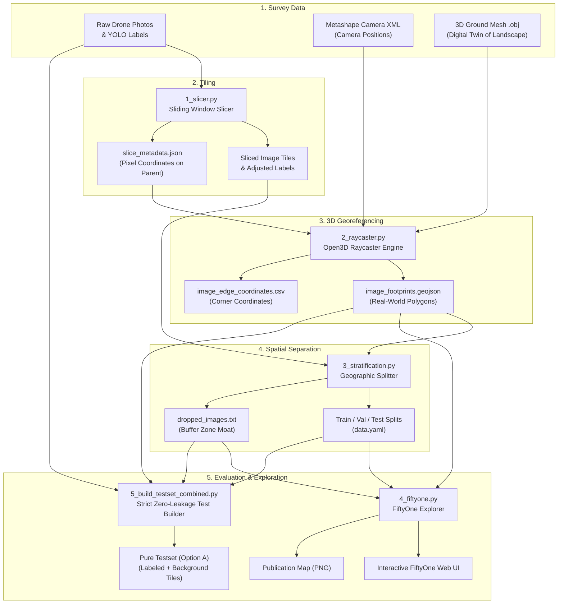

# Geospatial YOLO Pipeline

[](https://pixi.sh)
[](https://www.python.org/)
[](http://www.open3d.org/)
[](https://voxel51.com/fiftyone/)
[](https://opensource.org/licenses/MIT)

A complete, end-to-end Python pipeline for preparing computer vision datasets from aerial drone surveys. This toolkit cuts large drone photos into model-ready patches, uses 3D terrain models to pinpoint where each image lands on Earth, splits the data geographically to prevent the AI from "cheating", and packages everything for training with **YOLO** and visual inspection in **Voxel51 FiftyOne**.

---

## 💡 At a Glance: What Does This Pipeline Do?

When monitoring forests or detecting invasive trees (such as the Tree of Heaven, *Ailanthus altissima* / *Götterbaum*), drones take thousands of high-resolution aerial photos. However, training an AI model directly on raw drone data presents three major hurdles:

| Challenge | What Happens if Ignored? | Our Solution |
| :--- | :--- | :--- |
| **1. Massive Images** | Drone photos are 20–50+ megapixels. Feeding them directly to an AI crashes GPU memory or shrinks images until trees become invisible specks. | **Smart Slicing (`1_slicer.py`)**: Cuts photos into standardized 1024×1024 tiles with overlap so trees on borders aren't cut in half. |
| **2. Camera Tilt & Hills** | Drones pitch and roll in the wind over hills. Flat 2D maps misplace image locations by tens of meters. | **3D Raycasting (`2_raycaster.py`)**: Shoots virtual 3D rays from the drone camera onto a 3D digital model of the landscape to find exact ground boundaries. |
| **3. AI "Cheating" (Data Leakage)** | Overlapping photos of the same tree land in both training and test sets. The AI merely memorizes the tree rather than learning to detect it. | **Spatial Stratification (`3_stratification.py`)**: Splits the land geographically (e.g., South for testing, North for validation) and inserts an empty buffer zone ("safety moat") between them. |

---

## 🗺️ Pipeline Architecture



---

## ⚡ Quickstart

This project uses [Pixi](https://pixi.sh) to handle all software packages automatically, including Python, 3D engines, and GIS tools, preventing library conflicts.

### 1. Install Pixi
If you do not have Pixi installed yet:
- **Windows (PowerShell)**:
  ```powershell
  iwr -useb https://pixi.sh/install.ps1 | iex
  ```
- **macOS / Linux**:
  ```bash
  curl -fsSL https://pixi.sh/install.sh | bash
  ```

### 2. Set Up the Environment
Clone this repository and run:
```bash
pixi install
```

### 3. Configure Your Paths (`config.yaml`)
All default paths, survey campaigns, and processing hyperparameters are centralized in [`config.yaml`](file:///C:/Users/emilb/Documents/GitHub/_trainer_dataset_prep/config.yaml). 

> [!NOTE]
> Your personal `config.yaml` is listed in `.gitignore`, so your machine-specific paths (e.g. drive letters or local folders) will **never** be committed or uploaded to GitHub.

To set up your configuration:
1. Copy the provided template:
   ```bash
   cp config.example.yaml config.yaml
   ```
2. Edit `config.yaml` to match your local folders and survey setup:
   ```yaml
   base_export_dir: "E:/Götterbaum/_export_data"
   raw_images_dir: "E:/Götterbaum"

   slicing:
     slice_size: 1024
     overlap_ratio: 0.2

   raycasting:
     utm_epsg: 32633
     campaigns:
       "2023":
         xml_path: "E:/Götterbaum/_export_data/ortho_sat/total_area_23/cameras.xml"
         mesh_path: "E:/Götterbaum/_export_data/ortho_sat/total_area_23/totareaAug23_decim.obj"
       "2024":
         xml_path: "E:/Götterbaum/_export_data/ortho_sat/total_area_24/cameras_33n.xml"
         mesh_path: "E:/Götterbaum/_export_data/ortho_sat/total_area_24/totarea_decim.obj"
   ```

### 4. Run Pipeline Tasks
You can execute each step using Pixi's built-in shortcuts (which automatically read your `config.yaml`):

```bash
# Step 1: Slice large photos into 1024x1024 tiles
pixi run slice

# Step 2: Calculate real-world GPS footprints using 3D surface models
pixi run raycast

# Step 3: Partition data into geographically isolated Train, Val, and Test folders
pixi run stratify

# Step 4: Open interactive dataset browser and export satellite overview maps
pixi run visualize

# Step 5: Build a pure, zero-leakage combined test set with realistic background tiles
pixi run build-testset
```

### 5. CLI Options & Custom Configurations
Every script in the pipeline supports command-line arguments via `argparse`:

#### A. Use an Alternative Config File (`--config` or `-c`)
If you maintain multiple survey sites or experiment profiles, you can point to any YAML configuration file:
```bash
pixi run python 1_slicer.py --config configs/site_b.yaml
pixi run python 2_raycaster.py -c configs/site_b.yaml
```

#### B. Override Specific Parameters on the Fly
Any individual command-line flag automatically overrides the YAML settings:
```bash
# Slicer with custom tile size and overlap
pixi run python 1_slicer.py --slice-size 512 --overlap-ratio 0.15

# Raycaster with custom metadata path and output folder
pixi run python 2_raycaster.py --metadata "path/to/slice_metadata.json" --export-dir "path/to/export"

# Stratification with custom split ratios (Train 80%, Val 10%, Test 10%)
pixi run python 3_stratification.py --split-ratio 0.8 0.1 0.1

# FiftyOne visualization with a custom dataset name and coordinate grid
pixi run python 4_fiftyone.py --dataset-name "forest_survey" --show-grid

# Strict testset builder with custom workers and export directories
pixi run python 5_build_testset_combined.py --export-dir "path/to/export" --max-workers 16

# View all options and flags for any script:
pixi run python <script_name>.py --help
```


---

## 📂 Step-by-Step Guide

### Step 1: Image Slicing — [`1_slicer.py`](file:///C:/Users/emilb/Documents/GitHub/_trainer_dataset_prep/1_slicer.py)
* **What it does**: Moves a 1024×1024 pixel sliding window across each large drone photo with a 20% overlap stride.
* **Label handling**: For each bounding box annotation on the parent photo, it checks whether it falls inside the tile. If a box crosses the tile edge, it clips the box to the boundary and calculates how much was preserved. If at least 20% of the tree is still visible (`min_area_ratio=0.2`), it saves the annotation in tile-relative coordinates.
* **Negative Background Sampling**: Object detection models need to see areas where the target tree does *not* exist to learn what background foliage looks like. The slicer saves a configurable fraction of empty tiles (e.g. 10% for training, 100% for validation/testing).
* **Key Output**: Generates `slice_metadata.json`, which logs the exact pixel coordinates (`x_start`, `y_start`, `x_end`, `y_end`) of every tile on the parent photo. This record is essential for the next step.

### Step 2: 3D Georeferencing — [`2_raycaster.py`](file:///C:/Users/emilb/Documents/GitHub/_trainer_dataset_prep/2_raycaster.py)
* **What it does**: Calculates where each tile actually sits on the surface of the Earth.
* **How it works**:
  1. Reads photogrammetry camera calibration files (`cameras.xml` exported from Agisoft Metashape), learning each photo's exact 3D position, altitude, pitch, roll, and focal length.
  2. Loads a 3D terrain mesh model (`.obj`) of the survey area.
  3. Uses Open3D to shoot virtual lines (rays) from the camera's optical center through each of the 4 corners of the image tile.
  4. Finds where the rays intersect the 3D surface mesh.
  5. Converts these 3D points into real-world geographic coordinates (Latitude and Longitude in WGS84).
* **Key Outputs**:
  - `image_footprints.geojson`: Closed polygon boundaries for every tile, viewable in GIS programs like QGIS.
  - `image_edge_coordinates.csv`: Coordinate table listing the four corners and elevation of every slice.

### Step 3: Spatial Splitting & Safety Moats — [`3_stratification.py`](file:///C:/Users/emilb/Documents/GitHub/_trainer_dataset_prep/3_stratification.py)
* **Why this matters**: In aerial drone imagery, nearby photos overlap heavily. If you split photos randomly (e.g., using a traditional 80/20 random split), adjacent photos of the exact same tree end up in both training and test sets. The model gets a near-perfect score during testing simply by recognizing familiar trees (data leakage), but fails in the real world.
* **How it works**:
  1. **Geographic Ordering**: Calculates the center point (centroid) of every tile footprint and sorts all tiles along the South-to-North axis.
  2. **Cohort Assignment**: Allocates the southernmost region to the **Test Set**, the northernmost region to the **Validation Set**, and the central area to the **Train Set**.
  3. **Safety Moat (Boundary Buffer)**: Checks whether any training image tile physically overlaps or touches a test or validation tile. All boundary-touching tiles are discarded into `dropped_images.txt`, creating a buffer zone between cohorts.
  4. **Geometry Cleaning**: Automatically fixes self-intersecting ("bowtie") polygons and removes oversized outliers caused by terrain misses.
* **Key Outputs**:
  - `sliced_split_dataset/`: Standard YOLO folder layout (`train/images`, `train/labels`, `val/`, `test/`).
  - `data.yaml`: Ready-to-use YOLO dataset configuration file.
  - `dropped_images.txt`: List of boundary tiles discarded to enforce zero leakage.

### Step 4: FiftyOne Ingestion & Mapping — [`4_fiftyone.py`](file:///C:/Users/emilb/Documents/GitHub/_trainer_dataset_prep/4_fiftyone.py)
* **What it does**: Imports the entire dataset into **Voxel51 FiftyOne**, allowing interactive visual inspection of images, bounding boxes, and metadata.
* **Interactive Map**: Displays a side-by-side view featuring image thumbnails alongside an interactive map pinned with GPS coordinates from `image_footprints.geojson`.
* **Ghost Tiles**: Re-injects the discarded boundary buffer images as gray "ghost" points so researchers can visually verify that the safety buffer cleanly separates the training and test areas.
* **Publication-Ready Map**: Automatically renders `geostrat_dataset_map.png`—a high-resolution overview map overlaid on real satellite imagery (Esri World Imagery) with a scale bar, north arrow, and clear legend.

### Step 5: Pure Zero-Leakage Test Set Builder — [`5_build_testset_combined.py`](file:///C:/Users/emilb/Documents/GitHub/_trainer_dataset_prep/5_build_testset_combined.py)
* **Why this matters**: To test an AI fairly, you need to see if it triggers false alarms on empty forest land. A test set composed only of annotated trees cannot measure False Positive rates. This script builds a comprehensive evaluation set combining labeled test slices with negative background slices from the same flight region.
* **Option A (Strict Zero-Leakage)**:
  - Selects unlabeled background slices that fall inside the designated Test area footprint.
  - Excludes any slice that touches or overlaps the South boundary buffer zone.
  - Excludes any slice that touches or overlaps any retained training image.
  - Pairs all background slices with empty label files (standard YOLO format for negative samples).
* **Automated Publication-Ready Cartography**:
  - Automatically renders [`testset_combined_points_map.png`](file:///E:/G%C3%B6tterbaum/_export_data/testset_unlabeled_combined/testset_combined_points_map.png)—a 4-way centroid point scatter map distinguishing 2023 vs. 2024 flights and labeled vs. unlabeled slices, with an overview, a 130m × 75m zoom detail callout, and an embedded Foreground/Background metrics card.
  - Automatically renders [`testset_combined_spatial_map.png`](file:///E:/G%C3%B6tterbaum/_export_data/testset_unlabeled_combined/testset_combined_spatial_map.png) and [`testset_combined_breakdown.png`](file:///E:/G%C3%B6tterbaum/_export_data/testset_unlabeled_combined/testset_combined_breakdown.png).
  - Supports `--plot-only` to rapidly regenerate all maps and figures from existing GeoJSON footprints without re-slicing images from disk:
    ```bash
    pixi run python 5_build_testset_combined.py --plot-only
    ```
* **Result**: Produces a pure test cohort (e.g. 4,721 slices: 257 labeled + 4,464 background) with guaranteed 0% overlap with the training set.

---

## 🛠️ Key Technical Safeguards

1. **Cross-Platform Unicode Path Handling**:
   Standard C++ OpenCV functions (`cv2.imread` / `cv2.imwrite`) fail silently on Windows when file paths contain non-ASCII characters (such as the German umlaut `ö` in `E:\Götterbaum`). This pipeline routes all image reads and writes through byte buffers (`np.fromfile` and `cv2.imdecode` / `cv2.imencode`), ensuring error-free operation on any operating system.
2. **Metric Distance Calculations (UTM Zone 33N)**:
   All geometric calculations (polygon areas, buffer intersections, centroid distances) are performed in the local metric coordinate system **EPSG:32633 (UTM Zone 33N)** rather than Web Mercator (EPSG:3857). Web Mercator distorts areas at higher latitudes, while UTM maintains true metric square-meter accuracy.
3. **Topological Auto-Repair (`.buffer(0)`)**:
   Complex 3D terrain raycasting can occasionally produce self-intersecting ("bowtie") polygons that cause spatial software to crash. Running `.buffer(0)` on all loaded polygons automatically repairs their topology without altering boundary accuracy.

---

## 📚 Appendix: Glossary of Terms & Concepts

This appendix explains technical terms used across the documentation and code in simple, everyday language.

### 3D Digital Twin / Surface Mesh (`.obj`)
A 3D virtual model of the landscape reconstructed from overlapping drone photos (using photogrammetry). It represents the hills, trees, roads, and ground surface as thousands of interconnected triangles.

### 3D Raycasting
A computer graphics technique where a straight mathematical line ("ray") is projected from a specific point (the drone camera's lens) in a specific direction into 3D space. The raycaster detects the exact 3D point where that line hits the surface mesh.

### Agisoft Metashape XML (`cameras.xml`)
A structured text file produced by photogrammetry software. It records where the drone was in 3D space for each photo (camera position and altitude), which way it was pointing (yaw, pitch, roll), and the camera lens properties (focal length, sensor size, lens distortion).

### Background (Negative) Images
Image tiles that contain no target trees (no bounding boxes). In YOLO format, negative images have a corresponding empty `.txt` file. They are vital during training and testing to teach the model not to mistake ordinary leaves, bushes, or grass for the target species.

### Boundary Buffer ("Safety Moat")
A strip of land between two dataset splits (e.g. between the Training area and the Test area) where all overlapping or border-crossing photos are deliberately thrown out. This ensures that no single tree or landscape feature can be seen by both the training and testing sets.

### Centroid
The geometric center point of a shape or polygon. For an image footprint, the centroid is the average latitude and longitude of its boundary corners.

### Coordinate Reference System (CRS) & EPSG
A standardized mathematical system for locating points on the Earth's curved surface:
- **WGS84 (EPSG:4326)**: Standard GPS coordinates measured in degrees of Latitude and Longitude (e.g., `48.2082° N, 16.3738° E`).
- **UTM Zone 33N (EPSG:32633)**: A metric map projection covering Central Europe where coordinates are measured in real meters (Easting and Northing). Used in this pipeline for accurate area and distance measurements.
- **Web Mercator (EPSG:3857)**: The coordinate system used by web map providers (Google Maps, OpenStreetMap, Esri). Used here for displaying satellite basemap tiles.

### Data Leakage (Spatial Autocorrelation)
A common pitfall in machine learning. When two photos are taken just a few meters apart, they share almost the identical background, lighting, and foliage. If one photo is used for training and the other for testing, the AI will easily recognize the scene and score high on tests without truly learning how to generalize to new, unseen forests.

### Ghost Slices / Buffer Slices
Image slices that were discarded during spatial stratification because they fell into the boundary buffer zone. In `4_fiftyone.py`, these slices are plotted as semi-transparent gray squares so researchers can visually verify that the safety moat is working correctly.

### Intersection over Union (IoU)
A metric used to measure how much two shapes overlap, calculated by dividing the overlapping area by the total combined area. Used to detect whether image footprints clash across dataset boundaries.

### Option A (Strict Pure Test Cohort)
A test set configuration that strictly eliminates all data leakage risk. It excludes any unlabeled candidate slice that touches the boundary buffer or overlaps any training photo. Only slices located safely inside the pure test zone are retained.

### Orthophoto / Orthomosaic
A large aerial photograph composed of multiple stitched drone images that has been geometrically corrected ("orthorectified") so that the scale is uniform across the entire image, matching a flat map.

### Pinhole Camera Model
The standard mathematical representation of a camera. It models how 3D real-world coordinates pass through a camera lens to project onto a 2D digital image sensor.

### Self-Intersecting ("Bowtie") Polygon
A polygon whose outer boundary crosses over itself, creating a figure-8 or bowtie shape. These can occur when a camera shoots at an oblique angle across rugged terrain. Standard GIS tools consider them invalid; applying a zero-width buffer (`.buffer(0)`) automatically untangles them into clean shapes.

### Spatial Stratification
The practice of splitting data into train, validation, and test subsets based on geographic location (e.g. South vs. North) rather than choosing images at random. This is essential for aerial and satellite machine learning.

### Tiling / Slicing / Patches
The process of chopping a massive high-resolution image into smaller, manageable square images (e.g., 1024×1024 pixels) that match the input dimensions expected by neural networks.

### Voxel51 FiftyOne
An open-source visualization and dataset curation tool for computer vision. It allows users to browse thousands of images, filter by metadata and labels, find dataset errors, and inspect geographic locations on interactive maps.

### YOLO (You Only Look Once)
A state-of-the-art deep learning architecture for real-time object detection. YOLO predicts bounding boxes and class probabilities for objects in an image in a single pass through the neural network.
