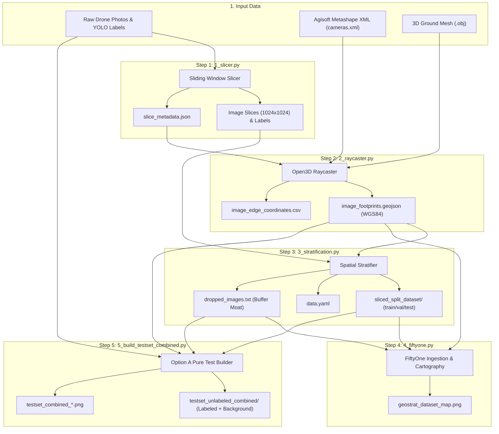

# AGENTS.md - Agent Operating Guidelines & Repository Knowledge Base

Welcome to the **Geospatial YOLO Pipeline** repository. This document serves as the single source of truth for AI agents (and human developers) interacting with, extending, or maintaining this codebase.

---

## 1. Repository Purpose & Architecture

This repository contains an end-to-end Python processing pipeline designed for computer vision applications on high-resolution aerial drone photogrammetry surveys (specifically tailored for tree species detection like *Ailanthus altissima* / Tree of Heaven).

### Core Challenges Solved
1. **Massive Image Resolutions**: Drone photos (20–50+ megapixels) cannot be fed directly into standard object detection networks like YOLO.
2. **Terrain Distortion & Tilt**: Drone pitch, roll, and elevation changes mean simple 2D map projections misplace image boundaries.
3. **Spatial Data Leakage**: Overlapping images of the same trees across flight passes cause severe data leakage if split randomly.
4. **Negative Background Sampling**: Detectors require negative (unlabeled background) tiles to avoid excessive false positives.

### Data Flow Overview



---

## 2. Directory Layout & Key Files

| File / Directory | Description |
| :--- | :--- |
| [`pixi.toml`](file:///C:/Users/emilb/Documents/GitHub/_trainer_dataset_prep/pixi.toml) | Pixi project configuration defining Conda and PyPI dependencies, platforms, and shortcut tasks. |
| [`config.py`](file:///C:/Users/emilb/Documents/GitHub/_trainer_dataset_prep/config.py) | Central typed configuration reader. Parses `config.yaml` (or CLI `-c` / `--config`) and provides typed default constants. |
| [`config.example.yaml`](file:///C:/Users/emilb/Documents/GitHub/_trainer_dataset_prep/config.example.yaml) | Template configuration file tracking all available parameters across all pipeline stages. |
| [`plots/`](file:///C:/Users/emilb/Documents/GitHub/_trainer_dataset_prep/plots) | Centralized publication figure suite output folder where all cartographic maps and charts are saved. |
| [`1_slicer.py`](file:///C:/Users/emilb/Documents/GitHub/_trainer_dataset_prep/1_slicer.py) | Slices high-resolution photos into tiles, adjusts/clips YOLO bounding boxes, downsamples background tiles, and saves `slice_metadata.json`. |
| [`2_raycaster.py`](file:///C:/Users/emilb/Documents/GitHub/_trainer_dataset_prep/2_raycaster.py) | Reads Metashape camera XML and 3D OBJ mesh, casts rays via Open3D through tile corners, and generates WGS84 GeoJSON footprints. |
| [`3_stratification.py`](file:///C:/Users/emilb/Documents/GitHub/_trainer_dataset_prep/3_stratification.py) | Sorts footprints along the South-North axis to partition into Test, Train, and Val splits, discarding overlapping boundary tiles into a buffer moat. |
| [`4_fiftyone.py`](file:///C:/Users/emilb/Documents/GitHub/_trainer_dataset_prep/4_fiftyone.py) | Imports dataset splits, bounding boxes, and geolocation into Voxel51 FiftyOne, visualizes ghost buffer tiles, and exports publication maps. |
| [`5_build_testset_combined.py`](file:///C:/Users/emilb/Documents/GitHub/_trainer_dataset_prep/5_build_testset_combined.py) | Builds pure, zero-leakage combined evaluation set (positive labels + realistic negative background tiles from the test zone) with cartographic figures. |
| [`plot_testset_centroids.py`](file:///C:/Users/emilb/Documents/GitHub/_trainer_dataset_prep/plot_testset_centroids.py) | Generates high-resolution multi-temporal centroid maps for the extended testset, segregating 2023 vs 2024 UAV campaigns. |
| [`render_dataset_maps.py`](file:///C:/Users/emilb/Documents/GitHub/_trainer_dataset_prep/render_dataset_maps.py) | Master publication cartography suite generating whole dataset split maps, distillation maps, survey flight maps, and selected labelling maps. |
| [`README.md`](file:///C:/Users/emilb/Documents/GitHub/_trainer_dataset_prep/README.md) | User-facing documentation and quickstart instructions. |

---

## 3. Environment & Tooling Guidelines

### Package Management with Pixi
This repository strictly relies on [Pixi](https://pixi.sh) (`pixi.toml` and `pixi.lock`) to manage cross-platform Conda and PyPI environments:
- **Python Version**: `3.10.*`
- **NumPy Pin**: `numpy = "<2.0.0"` (required for binary compatibility with Open3D and FiftyOne).
- **OpenCV Dependency**: `opencv-python` must remain under `[pypi-dependencies]` to avoid Windows DLL symbol collisions with FiftyOne's precompiled binaries.

### Standard Commands

```bash
# Install / sync environment
pixi install

# Run predefined pipeline tasks
pixi run slice
pixi run raycast
pixi run stratify
pixi run visualize
pixi run build-testset
pixi run plot-testset
pixi run plot-all

# Run any arbitrary python command in the managed environment
pixi run python <script_name>.py [flags]
```

---

## 4. Configuration System & Precedence

All pipeline scripts follow a strict three-tier configuration hierarchy:
1. **Command-Line Arguments (`argparse`)**: Highest precedence. Allows ad-hoc overrides (e.g., `--slice-size 512` or `--config alternative.yaml`).
2. **YAML Configuration File (`config.yaml`)**: Loaded dynamically by [`config.py`](file:///C:/Users/emilb/Documents/GitHub/_trainer_dataset_prep/config.py). Ignored by git (`.gitignore`) to prevent leaking machine-specific paths.
3. **Script In-Memory Defaults**: Hardcoded fallback values defined in [`config.py`](file:///C:/Users/emilb/Documents/GitHub/_trainer_dataset_prep/config.py).

### Rules for Agents Editing Configuration
- **Never commit local machine paths** (e.g. `C:\...` or `E:\...`) into tracked files.
- Whenever you add a new configuration parameter in [`config.py`](file:///C:/Users/emilb/Documents/GitHub/_trainer_dataset_prep/config.py), you **must** also add it with sensible placeholder values and explanatory comments in [`config.example.yaml`](file:///C:/Users/emilb/Documents/GitHub/_trainer_dataset_prep/config.example.yaml).
- Ensure that scripts expose corresponding CLI flags in their `parse_args()` function so parameters can be overridden at runtime.

---

## 5. Critical Engineering Invariants & Safeguards

When writing or modifying code in this repository, agents **must** adhere to the following non-negotiable safeguards:

### 1. Robust Unicode Path Handling on Windows
Standard C++ bindings in OpenCV (`cv2.imread` / `cv2.imwrite`) fail silently on Windows when encountering non-ASCII paths (e.g., German umlauts `ö`, `ä`, `ü` in `E:/Götterbaum/`).
- **Never** call `cv2.imread(path)` or `cv2.imwrite(path, img)` directly on user paths.
- **Always** use the byte-buffer methods [`read_image_robust`](file:///C:/Users/emilb/Documents/GitHub/_trainer_dataset_prep/1_slicer.py#L38-L56) and [`write_image_robust`](file:///C:/Users/emilb/Documents/GitHub/_trainer_dataset_prep/1_slicer.py#L58-L82):
  ```python
  # Reading:
  buffer = np.fromfile(file_path, dtype=np.uint8)
  image = cv2.imdecode(buffer, cv2.IMREAD_COLOR)

  # Writing:
  is_success, buffer = cv2.imencode(".jpg", image, [int(cv2.IMWRITE_JPEG_QUALITY), quality])
  buffer.tofile(file_path)
  ```

### 2. Metric CRS for Spatial Calculations
- Geospatial footprints are stored and interchanged in **WGS84 (EPSG:4326)** (degrees of latitude and longitude) for GeoJSON compatibility.
- However, all spatial operations—such as calculating polygon areas, buffer distances, centroids, and IoU overlaps—**must be transformed to a projected metric coordinate system** (default: **EPSG:32633, UTM Zone 33N**).
- **Never** compute Euclidean distance or area directly on WGS84 degree coordinates, as degrees do not correspond to fixed metric units.

### 3. Topological Auto-Repair (`.buffer(0)`)
- 3D raycasting over steep terrain or camera pitch can produce self-intersecting ("bowtie") polygons.
- Standard GIS operations (e.g. Shapely intersection, overlay) will raise topology errors or silently produce invalid geometries.
- **Always** call `.buffer(0)` on loaded polygons to automatically clean bowtie self-intersections before calculating intersections or spatial joins.

### 4. Zero Data Leakage Invariant
- Aerial imagery has high spatial autocorrelation.
- When splitting datasets into `train`, `val`, and `test`, candidate training tiles that physically touch, overlap, or fall within the buffer zone of validation or test tiles **must be discarded** and recorded in `dropped_images.txt`.
- Slices in `testset_unlabeled_combined` must never overlap with retained training images.

### 5. Negative Sample YOLO Annotations
- In YOLO object detection format, background images (images containing 0 annotations) must have a corresponding empty `.txt` label file (0 bytes).
- Do not omit the label file for negative samples; omitting the `.txt` file causes YOLO loaders to treat the sample as unannotated or missing rather than an explicit negative.

### 6. Centralized Figure Routing & Multi-Temporal Cartography
- **Dedicated Output Directory**: All publication-ready figures, maps, and breakdown charts must be saved into [`plots/`](file:///C:/Users/emilb/Documents/GitHub/_trainer_dataset_prep/plots) in the repository root and mirrored into the active dataset export directory (`testset_unlabeled_combined/plots/`).
- **Minimalist Publication Standards**:
  - Clean cartographic maps with true metric coordinate systems (UTM Zone 33N Easting & Northing [m]) and a high-precision scale bar (Maßstab).
  - Never include speech bubbles, text banners, callout boxes, or statistics card overlays across the map canvas.
  - **All font sizes must be at least 16 pt for primary map elements** (axis labels 18 pt, ticks 16 pt, legends 16 pt, scalebar 16 pt).
  - **Minimalist Two-Tone North Arrow**: Classic publication compass rose needle (dark navy left half, white right half with crisp borders) with bold 'N' above featuring a subtle white outline. Positioned near the top (`y_tip=0.890`) safely inside the satellite imagery canvas, supporting both top-left (default) and top-right placement.
  - **Satellite Tile Attribution**: Discrete attribution positioned at bottom-left (`x=0.015, y=0.015, ha='left', va='bottom'`) at ~11 pt: `"Satellite Imagery: © Esri, Maxar, Earthstar Geographics"`.
  - **Dedicated Bottom Spatial Buffer**: All maps apply an asymmetric bottom margin (`pad_y_bottom > pad_y_top`) on the Northing axis to ensure bottom-left attribution and bottom-right scale bar do not cover or overlap data points.
  - **Synchronized Global Wide Extent**: All five wide-area maps (`whole_dataset_images_2023_map.png`, `whole_dataset_images_2024_map.png`, `whole_dataset_images_by_year.png`, `selected_images_for_labelling_map.png`, `distillation_dataset_map.png`) share the exact same bounding box, metric tick intervals (250m / 200m), scale bar (200m), and aspect ratio.
  - **Clean Top Legends**: Legends are placed horizontally above the map (`bbox_to_anchor=(0.5, 1.02)` or `(0.0, 1.02)`), maximizing available map canvas width and area on publication pages (e.g., top half of portrait A4 Word documents) without lateral compression.
  - **Thin White Border Invariant**: Scatter points feature a crisp thin white border (`edgecolors='white', linewidths=0.7`), **except** dense point clouds (distillation training set `s=2.5`, combined flight passes `s=11`) and dropped buffer moat points which remain borderless (`edgecolors='none'`).
- **Dataset Map Cohorts ([`render_dataset_maps.py`](file:///C:/Users/emilb/Documents/GitHub/_trainer_dataset_prep/render_dataset_maps.py))**:
  1. **Whole Dataset Splits**: Train = Vibrant Red (`#ff2222`), Val = Vibrant Bright Green (`#00e676`), Test = Blue (`#2563eb`), Dropped Buffer Moat = Gray opaque ghost points (`#64748b` without white border and without crosses). 2023 survey shown as solid circles; 2024 survey marked with a thin cross (`linewidths=0.5`) inside the circle.
  2. **Distillation Pretraining Set**: Shows the complete Stage 1 distillation dataset containing all 119,137 slices (113,564 unlabeled background slices + 5,573 labeled train slices) spanning the western/southern parcel and central area, plotted with small red points (`s=2.5`), together with Validation (bright green) and Test (blue) splits (without the buffer zone). No distinction between 2023 and 2024 flight campaigns (no crosses, clean 3-entry legend).
  3. **Extended Test Set**: Single publication map (`extended_testset_centroids_map.png`) displaying the Original Labeled Test Slices ($n=257$, Deep Royal Blue `#1d4ed8`, diamond marker) vs Extended Unlabeled Background Slices ($n=4,464$, Sky Blue `#38bdf8`, circle marker) with thin white borders. No campaign breakdown or multi-panel subplots.
  4. **Whole Dataset Survey Locations**: Raw camera flight paths plotted using consistent colors (2023 = Deep Sky Blue `#0284c7`, 2024 = Vibrant Coral/Orange `#ea580c`) and circular points without crosses across all 3 variations. 2023, 2024, and combined maps share the exact same spatial extent; combined map uses smaller borderless points (`s=11`).
  5. **Selected Images for Labelling**: Combined map showing the 783 parent photos selected for annotation (326 in 2023 `#0284c7` vs 457 in 2024 `#ea580c`) with thin white borders, strictly matching the view extent of the survey maps.

---

## 6. Code Style & Development Conventions

- **Typing**: Use standard Python type annotations (`Path`, `Optional`, `List`, `Dict`, `Tuple`, `Any`) across all function signatures.
- **Paths**: Standardize path manipulations using `pathlib.Path`. When resolving paths or printing, convert to strings or POSIX-compatible representations where needed.
- **Progress Bars & CLI Feedback**: Use `tqdm` for long-running batch operations (such as image slicing, raycasting, or multi-threaded copy workers).
- **Preserve Comments & Docstrings**: Keep existing module docstrings, parameter descriptions, and inline architectural comments intact.
- **Multithreading**: For disk-bound I/O tasks (e.g., slicing or copying tiles), prefer `concurrent.futures.ThreadPoolExecutor` with a configurable `max_workers` setting.

---

## 7. Common Agent Tasks & Verification Steps

### Checking Script Syntax & CLI Interfaces
Before committing changes to any pipeline script, verify that argument parsing and syntax are valid:
```bash
pixi run python 1_slicer.py --help
pixi run python 2_raycaster.py --help
pixi run python 3_stratification.py --help
pixi run python 4_fiftyone.py --help
pixi run python 5_build_testset_combined.py --help
pixi run python plot_testset_centroids.py --help
pixi run python render_dataset_maps.py --help
```

### Fast Map / Cartography Verification
When modifying plotting or visualization logic:
```bash
# Re-render all publication dataset maps (whole splits, distillation, flights, labels) into plots/
pixi run plot-all

# Re-render extended testset centroid maps (shades of blue) into plots/
pixi run plot-testset

# Re-render all combined testset cartography (footprints, breakdown, points) into plots/
pixi run build-testset --plot-only
```
